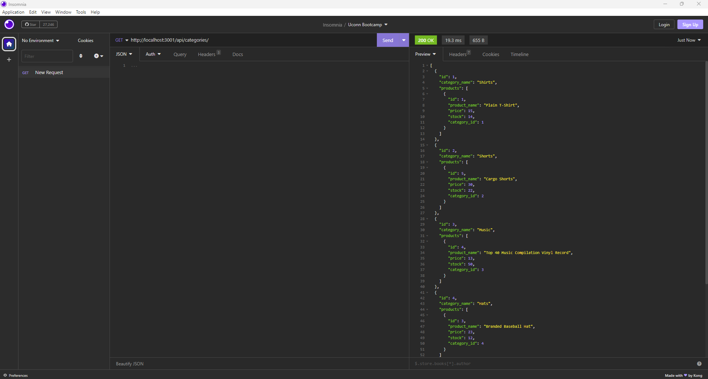

# E-Commerce Back End

## Description

This application used started code to develop the back end for an e-commerce site. It configures a working Express.js API to use Sequelize to interact with a MySQL database.

Click the image below to see a demo of the application.

## Table of Contents
- [Description](#description)
- [Installation](#installation)
- [Usage](#usage)
- [Contributing](#contributing)
- [Questions](#questions)

## Installation
In order to install express, mysql2, and sequelize, please use:  
npm i

## Usage
As a manager at an internet retail company, I want a back end for my e-commerce website that uses the latest technologies so that my company can compete with other e-commerce companies.

The application will be invoked by using the following command: 
node server.js

## Contributing
Thank you for your interest in my project. I am excited to see your contributions. Please follow the [Contributor Covenant](https://www.contributor-covenant.org/).

## Questions
If you have additional questions, please email me at bsimmonds28@gmail.com.
To see more of my work, find me on GitHub at [bsimmonds28](https://github.com/bsimmonds28)!

